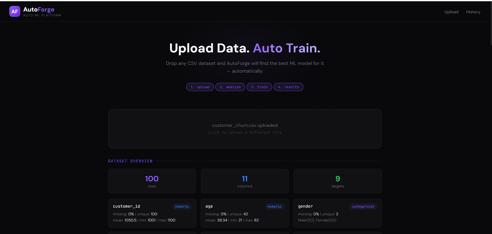
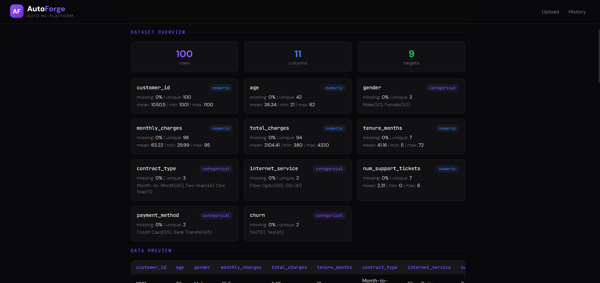
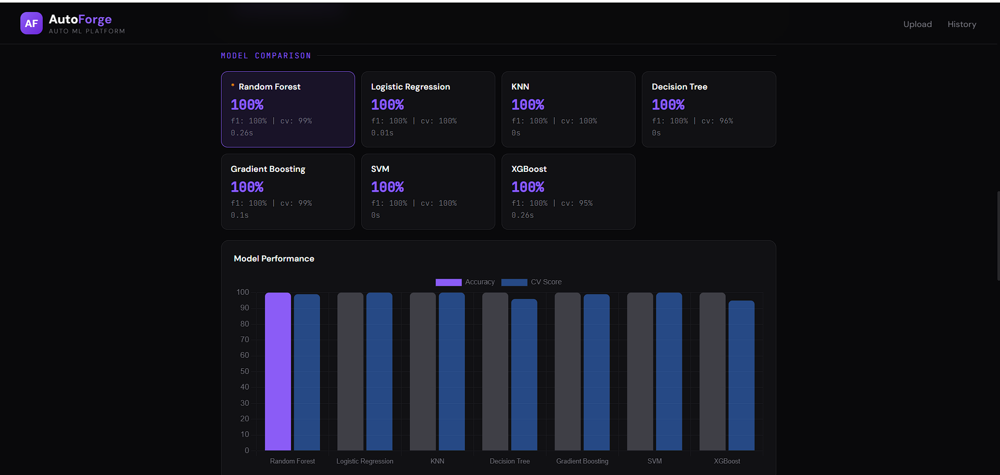
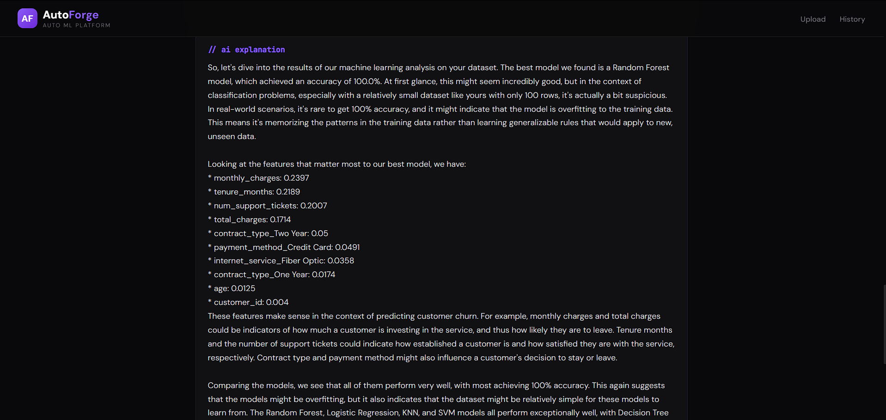

# AutoForge


AI-powered AutoML platform that automatically analyzes datasets, trains multiple ML models, compares their performance, and explains results using AI.

Upload any CSV dataset, pick a target column, and AutoForge handles the rest — preprocessing, training 7+ models, finding the best one, and giving you an AI-generated explanation of the results.

## Screenshots

### Upload Page


### Dataset Analysis


### Training Results


### AI Explanation


## Tech Stack

- **Backend:** Python, FastAPI
- **ML:** Scikit-learn, XGBoost, Pandas, NumPy
- **AI:** Groq API (Llama 3.3 70B) for result explanation
- **Database:** MySQL
- **Frontend:** HTML, CSS, JavaScript, Chart.js

## How It Works

1. Upload a CSV dataset
2. AutoForge analyzes columns, detects types, and shows stats
3. Select a target column (classification or regression)
4. Trains 7 models — Random Forest, Logistic Regression, KNN, Decision Tree, Gradient Boosting, SVM, XGBoost
5. Compares accuracy, F1 score, cross-validation scores
6. Picks the best model and extracts feature importance
7. AI explains the results in plain english

## Models Trained

| Classification | Regression |
|---|---|
| Random Forest | Random Forest |
| Logistic Regression | Linear Regression |
| KNN | Ridge Regression |
| Decision Tree | KNN |
| Gradient Boosting | Decision Tree |
| SVM | Gradient Boosting |
| XGBoost | SVR / XGBoost |

## Setup

```bash
pip install -r requirements.txt
```

Create a `.env` file:
```
GROQ_API_KEY=your_groq_api_key
MYSQL_HOST=localhost
MYSQL_USER=root
MYSQL_PASSWORD=your_password
MYSQL_DATABASE=autoforge
```

Run:
```bash
python main.py
```

Open `http://localhost:8002`
